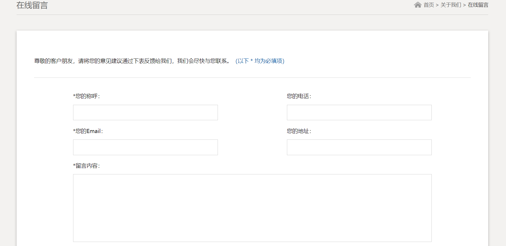

# django 设计的公司网站
## 基本功能如下：

后台添加主页展示图片和产品：

留言功能：

产品筛选功能：

修改步骤：
1，删除自带数据库，db.splite3,

   进行数据迁移,执行命令

  python manage.py makemigrations

  python mange.py migrate

  创建超级用户

  python manage.py createsuperuser

2，修改留言功能的邮箱为自己的邮箱：

views.py:

settings.py:

